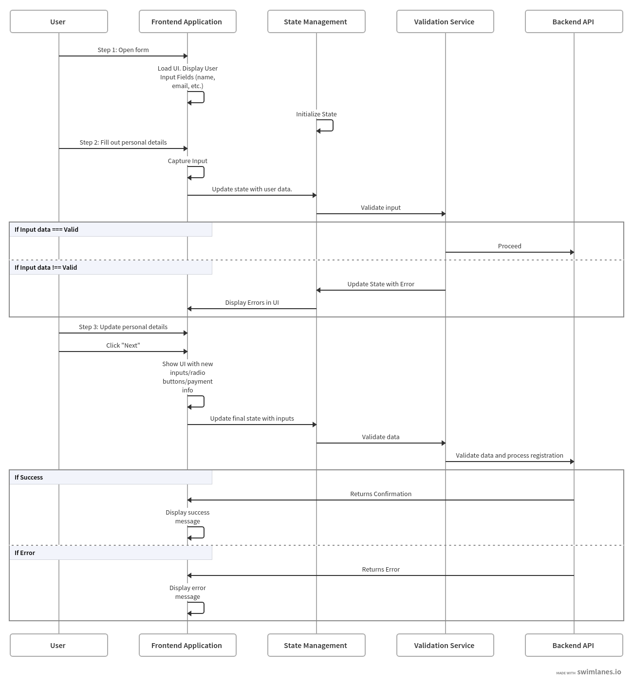

# Job Portal Form

This is a **multi-step job portal form** application built with React. The project is set up with TypeScript, and you can run it locally using the instructions below.

## Prerequisites

Make sure you have the following installed on your local machine:

- [Node.js](https://nodejs.org/) (version 16 or later)
- [npm](https://www.npmjs.com/) (Node Package Manager, usually comes with Node.js)
- [yarn](https://yarnpkg.com/) (optional but recommended for faster dependency installation)

## Setup Instructions

### 1. Clone the repository

Clone the project to your local machine using Git:

```bash
git clone https://github.com/yourusername/job-portal-form.git
```

### 2. Install Dependencies

```cd job-portal-form
npm install
```

#### Or if using Yarn

```
yarn install
```

### Run tests

```
npm test
```

### Additional Information

### This project is built using React and TypeScript, with the following dependencies:

```
React 18
TypeScript 5.6
React Router DOM
```

## What I showcase with this project:

1. **Form Validation & Error Handling:** Use TypeScript for type-safe form inputs and validation.

2. **State Management:** Implement React’s Context API or a library to manage form state across steps.

3. **UX/UI Focus:** Design a seamless user experience with clear navigation and feedback (e.g., progress indicator). This Includes media-queries for different screen sizes. 404 page.

4. **Reusable Components:** Each form step as a standalone component for easier maintenance.

5. **Thorough Commenting:** Detailed comments to show thought process for validation and state handling.

6. **Testing:** Unit tests for validation logic, component render tests, and potentially end-to-end testing for form completion.

7. **Backend API:** Use a mock backend like JSON Placeholder or Mock API for the HTTP Post requests when submitting data.

### Diagram Guide


